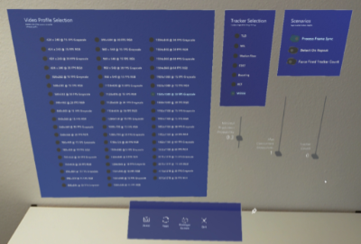

# Lab Assist Vision

Proof of concept of a mixed reality application for the Microsoft HoloLens 2 integrating object recognition using cloud computing and real-time on-device markerless object tracking. The augmented objects provide interaction using hand input, eye-gaze, and voice commands to verify the tracking result visually.

This work is part of the thesis "*Mixed Reality Task Assistance for Pharmaceutical Laboratories using Markerless Object Tracking and Cloud Services*" submitted to the [University of Applied Sciences Northwestern Switzerland](https://www.fhnw.ch) at the [Institute for Interactive Technologies (IIT)](https://www.fhnw.ch/en/about-fhnw/schools/school-of-engineering/institutes/institute-for-interactive-technologies).

Author: [Severin Pereto](https://github.com/cookieofcode)\
Supervisor: [Prof. Dr. Doris Agotai](https://www.fhnw.ch/de/personen/doris-agotai)

## Overview

*Lab Assist Vision* provides a showcase for markerless tracking in pharmaceutical laboratories using the [Microsoft HoloLens 2](https://www.microsoft.com/de-de/hololens/hardware). Using the voice command *"Detect,"* objects are recognized by a cloud service to initialize markerless tracking on the device. The tracked laboratory items can be confirmed by eye gaze and the voice command *"Okay"* to change the tooltip color.

A demonstration video in full length is available at https://youtu.be/-usFovY6nD8. *Note that the video's quality is limited due to the simultaneous use of the color camera for tracking and mixed reality capture.*

### Key Features

- Provides a camera service using the [color camera](https://docs.microsoft.com/en-us/windows/mixed-reality/develop/platform-capabilities-and-apis/locatable-camera#hololens-2) of the Microsoft HoloLens 2 in Unity
  - The video format can be switched during runtime
  - Provides camera extrinsic and intrinsic
  - Supports grayscale images (extracting luminance from [NV12](https://docs.microsoft.com/en-us/windows/win32/medfound/recommended-8-bit-yuv-formats-for-video-rendering#nv12))
  - Supports [NV12](https://docs.microsoft.com/en-us/windows/win32/medfound/recommended-8-bit-yuv-formats-for-video-rendering#nv12) to RGB conversion using a fragment shader
  - Camera simulation using the WebCam in Unity Editor
- Object Detection using [Custom Vision](https://customvision.ai) as Cloud Service
  - Provides tracker initialization for markerless tracking
  - *Experimental:* Run on repeat to provide tracking by detection
  - *Experimental:* Object detection network (ONNX) locally on the device using [Barracuda](https://docs.unity3d.com/Packages/com.unity.barracuda@1.0/manual/index.html)
- Markerless object tracking using [OpenCV Tracking API](https://docs.opencv.org/4.5.0/d9/df8/group__tracking.html)
  - Implemented Trackers: MOSSE, TLD, Boosting, Median Flow, MIL, CSRT, KCF
  - *Real-time tracking (30 FPS) up to more than five concurrent tracked items is achieved using MOSSE at a resolution of 760x428 @ 30 FPS in grayscale and synchronous mode.*
- Mapping the 2D tracked object into 3D space using the [Spatial Mesh](https://docs.microsoft.com/en-us/windows/mixed-reality/design/spatial-mesh-ux).
- Interaction using hand input, eye gaze combined with voice commands (e.g. "*Detect*", "*Okay*") provided by [MRTK](https://github.com/microsoft/MixedRealityToolkit-Unity).
- Developer Console to change settings (e.g. video profile, color format, tracker, scenario) at runtime.
- Video display of the camera stream, including a debug view of the bounding boxes of tracked objects.

## Documentation

### Setup

*Lab Vision requires [OpenCVForUnity](https://assetstore.unity.com/packages/tools/integration/opencv-for-unity-21088) and a [Custom Vision](https://www.customvision.ai) network, including prediction endpoint and key.* The following gives a step-by-step instruction to set up the project:

1. Open the project (e.g., in the Unity Hub) with Unity Version 2019.4.15f1 and Universal Windows Platform. *Note: Another Unity version may require adjustments or API updates (e.g. XR Plugin System)*

2. Import [OpenCVForUnity](https://assetstore.unity.com/packages/tools/integration/opencv-for-unity-21088) version 2.4.1 (e.g., using the Unity Package Manager). Only the OpenCVForUnity Wrapper API and prebuilt OpenCV for Windows and UWP are required.

3. Open the LabAssistVision scene.

4. Change the following in Build Settings (File > Build Settings) if needed:
   - Platform: Universal Windows Platform
   - Target Device: HoloLens

5. Verify the project settings (see [Project Configuration](#project-configuration))

6. Add the Custom Vision prediction key and prediction endpoint obtained from the portal to the [CustomVisionObjectDetectionService](Assets/MixedRealityToolkit.Generated/Extensions/Detection/CustomVisionObjectDetectionService.cs) profile. This setting can be found in the Game Object "MixedRealityToolkit" under the tab Extensions > Configurations > CustomVisionObjectDetectionService > DefaultObjectDetectionServiceProfile. *Note: If no profile is assigned, assign the default or create a new one*.

### Dependencies

The following table highlights specific dependencies in this project:

| Dependency | Version | Resolvment | Remark |
| ------------- |:-------------:| :-----| :---|
| [OpenCVForUnity](https://assetstore.unity.com/packages/tools/integration/opencv-for-unity-21088) | 2.4.1 | Import manually (see [Setup](#setup)) | Paid Unity asset with precompiled [OpenCV](https://opencv.org) for [UWP](https://docs.microsoft.com/en-us/windows/uwp/) |
| [NuGet for Unity](https://github.com/GlitchEnzo/NuGetForUnity) | 2.0.1 | Included in repository |  Licensed under the MIT License |
| [DotNetWinRT](https://www.nuget.org/packages/Microsoft.Windows.MixedReality.DotNetWinRT) | 0.5.1049 | Included in repository, resolved by NuGet for Unity | NuGet Package |
| [Mixed Reality Toolkit for Unity](https://github.com/microsoft/MixedRealityToolkit-Unity) | 2.5.1 | Resolved by Unity Package Manager | Licensed under the MIT License |
| [Barracuda](https://docs.unity3d.com/Packages/com.unity.barracuda@1.0/manual/index.html) | 1.0.4 | Resolved by Unity Package Manager | Required to run the Custom Vision network on the device (experimental feature) |
| [Windows Mixed Reality](https://docs.unity3d.com/Packages/com.unity.xr.windowsmr.metro@4.2/manual/index.html) | 4.2.3 | Resolved by Unity Package Manager | The Unity legacy XR plugin is currently used. This package is deprecated and will be removed in Unity 2020.1 |

### Project Configuration

Ensure that the following settings are configured in Unity:

- Build Settings
  - Platform: *Universal Windows Platform*
  - Target Device: *HoloLens*
- Project Settings
  - Player
    - Scripting Define Symbols: *`OPENCV_USE_UNSAFE_CODE;DOTNETWINRT_PRESENT`*
    - Allow 'unsafe' code: *true*
    - Capabilities: *InternetClient, InternetClientServer, PrivateNetworkClientServer, Webcam, Microphone, HumanInterfaceDevice, Spatial Perception, Gaze Input*
    - XR Settings
      - Virtual Reality Supported: *true*
      - Depth Format: *16-bit*
- Unity Editor: Ensure that all MRTK extension services have a profile assigned. (MixedRealityToolkit Game Object > Extension Services)
- Package Manager: The project is built using legacy XR (Windows Mixed Reality).

### Build

- Build the Project using ARM64 (Debug/Release). *Note that running in Debug mode has high impact on performance*.
- It is recommended to disable the Video Display (in the Unity Editor) if not used for development, as it has an impact on tracking performance.

### Development

- It is possible to run the application using the Unity Editor and the Play Mode to get fast feedback during development. While object detection and tracking are supported, mapping to 3D is partially possible using Holographic Remoting due to missing intrinsic and extrinsic.
- The [`MonoCamera`](Assets/LabAssistVision/Camera/MonoCamera.cs) simulates the [Locatable Camera](https://docs.microsoft.com/en-us/windows/mixed-reality/develop/platform-capabilities-and-apis/locatable-camera) of the device in the Unity Editor. Using [PhotoCapture](https://docs.unity3d.com/ScriptReference/Windows.WebCam.PhotoCapture.html) used in a loop delivers the WebCam image in [NV12](https://docs.microsoft.com/en-us/windows/win32/medfound/recommended-8-bit-yuv-formats-for-video-rendering#nv12) format (at a low framerate). The camera extrinsic and intrinsic required for mapping the 3D position are ignored.
- In Holographic Remoting, the WebCam of the computer is used. A tracked object is then mapped to the collision point of the main camera's gaze and the [Spatial Mesh](https://docs.microsoft.com/en-us/windows/mixed-reality/design/spatial-mesh-ux).
- The video profile, color format, and tracker can be switched during runtime. *Real-time tracking (30 FPS) is achieved using MOSSE at a resolution of 760x428 @ 30 FPS in grayscale and synchronous mode.*

### Developer Console

The developer console provides a tool to change parameters at runtime (e.g., video parameters, color format, trackers). In *Video Profile Selection*, each available resolution and frame rate provided by the [Locatable Camera](https://docs.microsoft.com/en-us/windows/mixed-reality/develop/platform-capabilities-and-apis/locatable-camera) is available for each color format (RGB/Grayscale).

The *Tracker Selection* allows switching between tracker of the [OpenCV Tracking API](https://docs.opencv.org/4.5.0/d9/df8/group__tracking.html) implemented by [OpenCVForUnity](https://assetstore.unity.com/packages/tools/integration/opencv-for-unity-21088). Currently, these are *MOSSE*, *TLD*, *Boosting*, *Median Flow*, *MIL*, *CSRT*, *KCF*. *Note that some trackers only support a specific color format or are converting the image format internally, which impacts performance.*

The following lists configurable scenarios and their purpose:

- *Process Frame Sync:* The camera frame is processed synchronously. If calculations such as processing take longer than the time budget (16ms at 60 FPS, 33ms at 30 FPS), this will cause a drop in the application frame rate. If untoggled, frames are processed asynchronous, which can help evaluate trackers that require more time to process. In both cases, only one camera frame is processed at a time.
- *Detect On Repeat:* If enabled, tracking is ignored, and detection is invoked repeatedly. The slider Max Concurrent Detections sets the limit for concurrent requests.
- *Force Fixed Tracker Count:* This option initializes the detected object with the highest prediction multiple times. All other items are ignored. The number of clones can be specified using the slider Tracker Count. This option is used to measure performance across different trackers.

The toolbar follows the user's field of view until the position is fixed. It allows to trigger an object detection, reset the tracked objects, open the developer console, or quit the application.

### Notes regarding Software Architecture

Scripts for visualization purposes, such as [`VideoDisplayManager`](Assets/LabAssistVision/VideoDisplayManager.cs), [`VisualizationManager`](Assets/LabAssistVision/VisualizationManager.cs), and the [`Controller`](Assets/LabAssistVision/Controller.cs), are implemented as [`MonoBehaviour`](https://docs.unity3d.com/ScriptReference/MonoBehaviour.html) to enable support from the Unity Editor, and position game objects in the scene.

[MRTK](https://github.com/microsoft/MixedRealityToolkit-Unity) is built in a modular approach, provides a service locator component, and centralized as much of the configuration required as possible. This component is configurable in the Unity Editor and manages component lifespans and code behaviors. Extension services are services that extend the functionality of the [MRTK](https://github.com/microsoft/MixedRealityToolkit-Unity). After registration, the service is accessible using the [MRTK](https://github.com/microsoft/MixedRealityToolkit-Unity) service registry. See [this introduction](https://docs.microsoft.com/en-us/windows/mixed-reality/develop/unity/mrtk-getting-started) for an introduction to [MRTK](https://github.com/microsoft/MixedRealityToolkit-Unity).

A [`CameraService`](Assets/MixedRealityToolkit.Generated/Extensions/Camera/ICameraService.cs), an [`ObjectDetectionService`](Assets/MixedRealityToolkit.Generated/Extensions/Detection/IObjectDetectionService.cs), and an [`ObjectTrackingService`](Assets/MixedRealityToolkit.Generated/Extensions/Tracking/IObjectTrackingService.cs) are introduced as [MRTK extension services](https://microsoft.github.io/MixedRealityToolkit-Unity/Documentation/Extensions/ExtensionServices.html). The following list explains the purpose and different implementations of the services.

- *[`CameraService`](Assets/MixedRealityToolkit.Generated/Extensions/Camera/CameraService.cs):* Provides the camera frame depending on the platform. If running on the Microsoft HoloLens 2, the locatable camera is provided. Running in the Unity Editor, the WebCam is used.
- *[`CustomVisionObjectDetectionService`](Assets/MixedRealityToolkit.Generated/Extensions/Detection/CustomVisionObjectDetectionService.cs):* Provides asynchronous object detection for a camera frame. Currently, Custom Vision as Cloud Service and an experimental local detection service using Barracuda are provided.
- *[`ObjectTrackingService`](Assets/MixedRealityToolkit.Generated/Extensions/Tracking/ObjectTrackingService.cs):* Provides markerless object tracking using OpenCV.

## License

Lab Assist Vision is open for use in compliance with the [MIT License](LICENSE). The [grayscale shader](Assets/LabAssistVision/Shaders/Grayscale_MRTK.shader) for the video display and [FPSUtils](Assets/LabAssistVision/Utils/FPSUtils.cs) for measurement originate from [HoloLensARTookit](https://github.com/qian256/HoloLensARToolKit) and are licensed under the GNU Lesser General Public License v3.0.
